<div align="center">

# 🌐 2minsite — AI-Powered Website Builder SaaS

> Build, launch, and manage stunning e-commerce websites in minutes — no coding required.


</div>

---

## 📋 Table of Contents

- [Overview](#-overview)
- [Screenshots](#-screenshots)
- [Tech Stack](#-tech-stack)
- [Features](#-features)
- [Project Structure](#-project-structure)
- [Getting Started](#-getting-started)
- [Environment Variables](#-environment-variables)
- [Website Themes](#-website-themes)
- [API Routes](#-api-routes)
- [License](#-license)

---

## 🚀 Overview

**TWOMINSITE** is a full-stack SaaS platform that lets users create beautiful, themed e-commerce websites without writing a single line of code. Users can manage products, track analytics, and launch their storefront — all from a polished dashboard.

---

## 📸 Screenshots

###  Landing Page
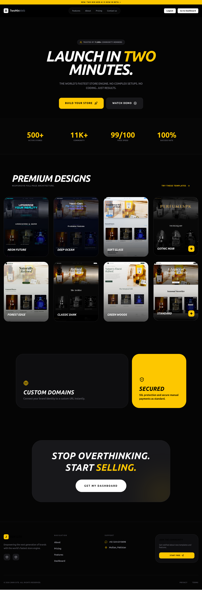

###  Home (Logged In)
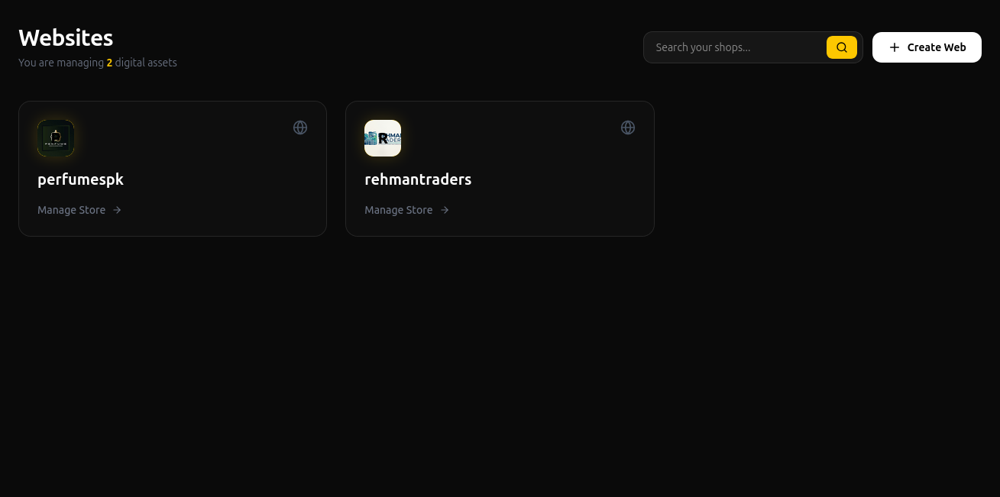

###  Dashboard
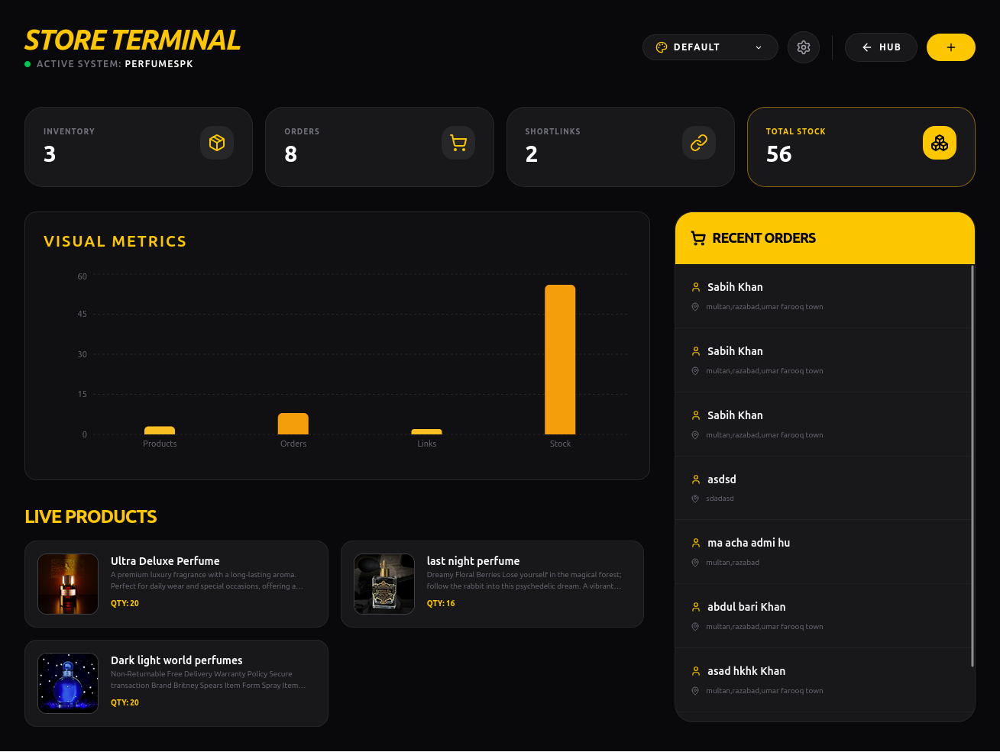

### Create Website
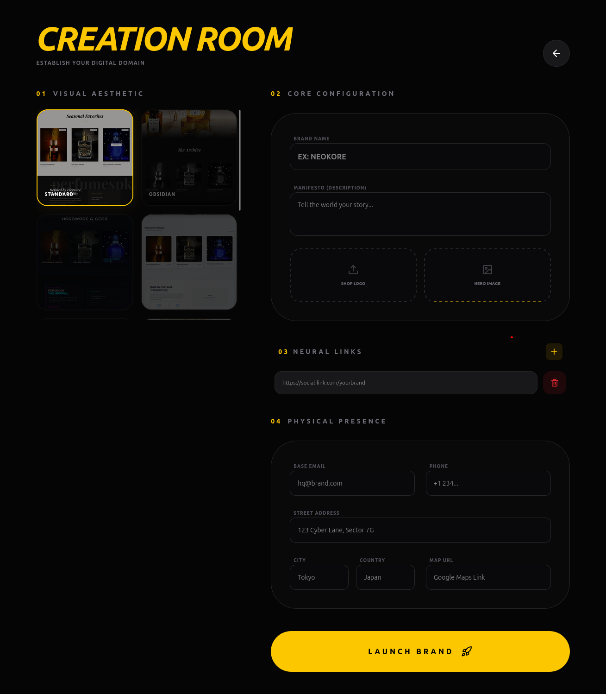

###  Add Product
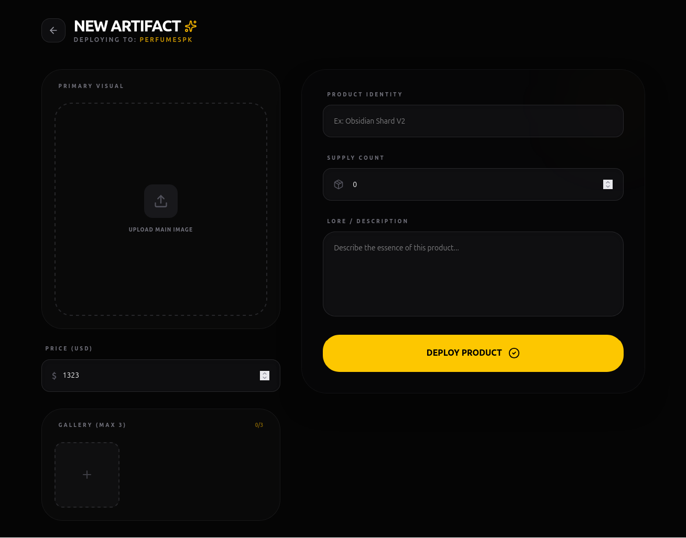

###  Pricing
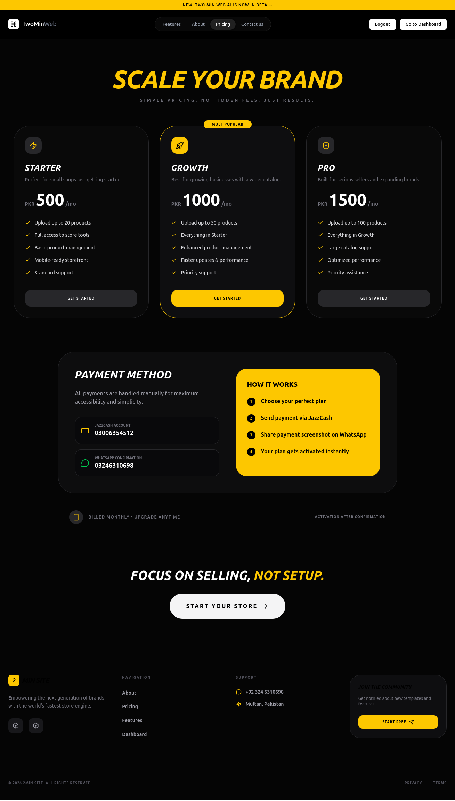

###  Login & Register
| Login | Register |
|-------|----------|
| 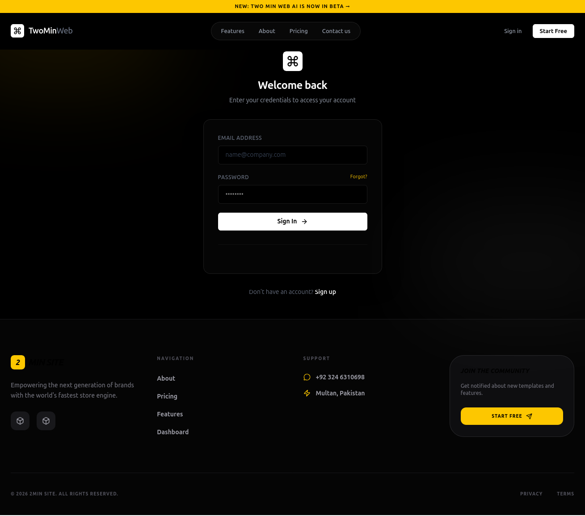 | 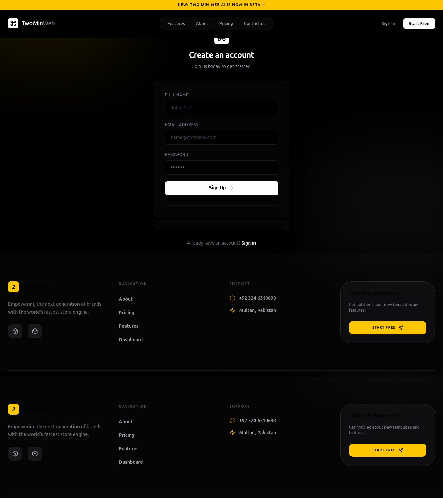 |

### ℹ About & Contact
| About | Contact Us |
|-------|------------|
| 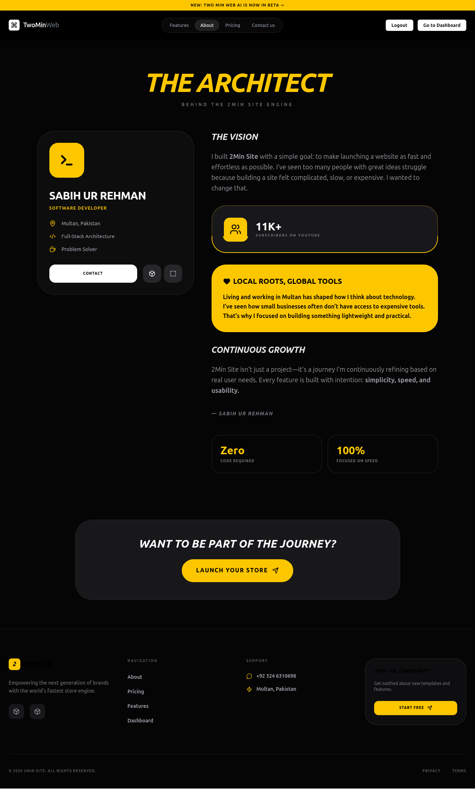 | 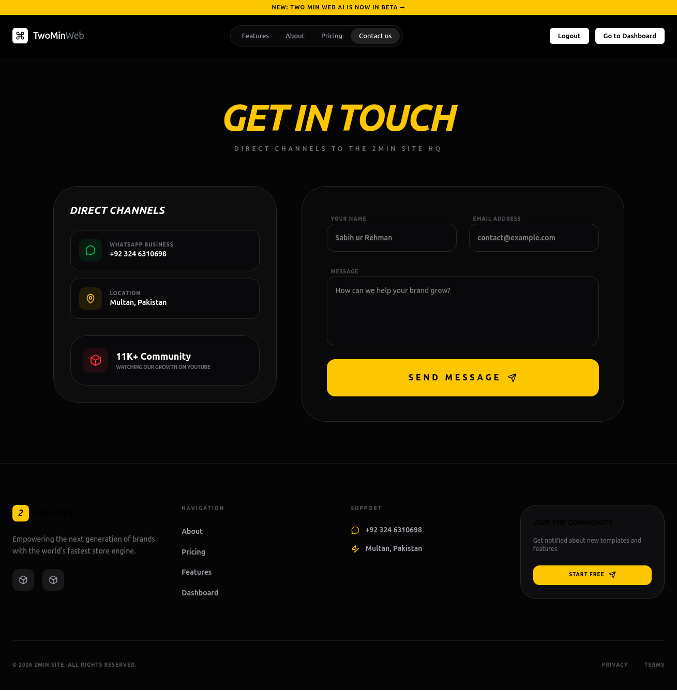 |

---

## 🛠 Tech Stack

### Frontend

| Technology | Purpose |
|---|---|
|  | UI Framework |
|  | Type Safety |
|  | Build Tool |
|  | Styling |
|  | Animations |
|  | State Management |
|  | HTTP Client |
|  | Routing |
|  | Analytics Charts |
|  | Icons |
|  | Image Uploads |

### Backend

| Technology | Purpose |
|---|---|
|  | Runtime |
|  | Web Framework |
|  | Type Safety |
|  | Database |
|  | ODM |
|  | Authentication |
|  | Password Hashing |
|  | Schema Validation |
|  | Email Service |
|  | Logging |
|  | API Protection |

---

## ✨ Features

- 🔐 **Auth System** — Secure JWT-based registration, login & logout with cookie management
- 🎨 **8 Website Themes** — Choose from Dark, Forest, Gothic, Neon Future, Soft Glass & more
- 🛒 **Product Management** — Add, update, and manage store products with image uploads via Cloudinary
- 📊 **Analytics Dashboard** — Visual charts powered by Recharts for store performance
- 📧 **Email Notifications** — Transactional emails via Nodemailer
- 🛡️ **Input Validation** — Full Zod schema validation on all API endpoints
- 🚦 **Rate Limiting** — Protection against API abuse
- 📝 **Structured Logging** — Winston-powered server logs
- 📱 **Responsive UI** — Mobile-first design with Tailwind CSS
- ⚡ **Animated UX** — Smooth transitions with Framer Motion

---

## 📁 Project Structure


├── backend/
│   └── src/
│       ├── controller/        # Business logic
│       ├── db/                # MongoDB connection
│       ├── middleware/        # Auth & upload guards
│       ├── models/            # Mongoose schemas
│       ├── routes/            # Express route definitions
│       ├── types/             # TypeScript interfaces
│       ├── utils/             # JWT, mailer, logger, website helpers
│       └── zodprotection/     # Zod validation schemas
│
├── frontend/
│   └── src/
│       ├── api/               # Axios instance
│       ├── components/        # Reusable UI components
│       ├── pages/             # Route-level page components
│       ├── store/             # Zustand global state
│       └── cloudinary/        # Image upload helper
│
├── images/                    # Screenshot assets
│   ├── frontendimages/
│   └── themeswebsiteimage/
│
└── websites/                  # Generated HTML website templates
├── darkfantasy/
└── premium/

---

## 🚀 Getting Started

### Prerequisites

- Node.js `v18+`
- MongoDB (local or Atlas)
- Cloudinary account

### 1. Clone the Repository

```bash
git clone https://github.com/yourusername/webcraft.git
cd webcraft
```

### 2. Install Backend Dependencies

```bash
cd backend
npm install
```

### 3. Install Frontend Dependencies

```bash
cd ../frontend
npm install
```

### 4. Configure Environment Variables

See [Environment Variables](#-environment-variables) below.

### 5. Run in Development

**Backend:**
```bash
cd backend
npm run dev
```

**Frontend:**
```bash
cd frontend
npm run dev
```

---

## 🔑 Environment Variables

### Backend (`backend/.env`)

```env
PORT=5000
MONGO_URI=your_mongodb_connection_string
JWT_SECRET=your_jwt_secret
JWT_EXPIRES_IN=7d
EMAIL_USER=your_email@gmail.com
EMAIL_PASS=your_email_app_password
CLIENT_URL=http://localhost:5173
```

### Frontend (`frontend/.env`)

```env
VITE_API_URL=http://localhost:5000/api
VITE_CLOUDINARY_CLOUD_NAME=your_cloud_name
VITE_CLOUDINARY_UPLOAD_PRESET=your_upload_preset
```

---

## 🎨 Website Themes

| Theme | Preview |
|-------|---------|
| **Default** | 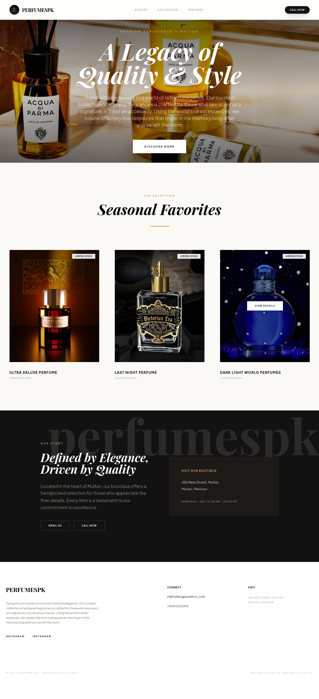 |
| **Dark** | 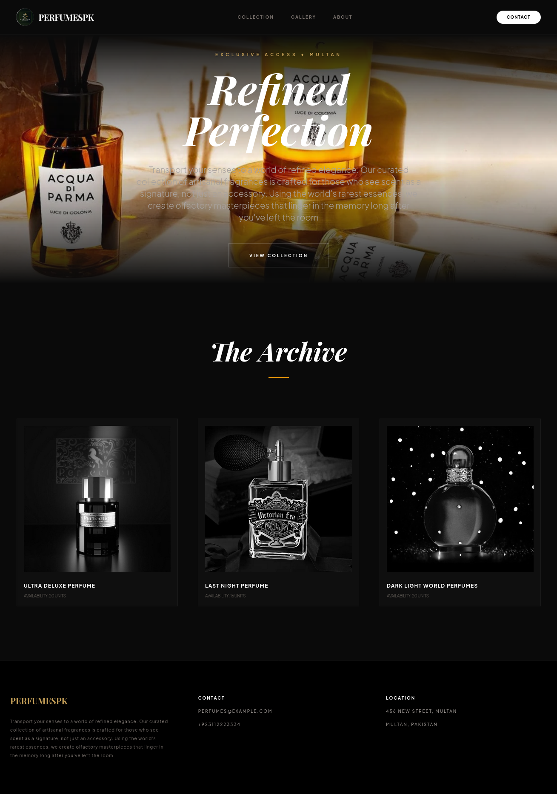 |
| **Dark Blue** | 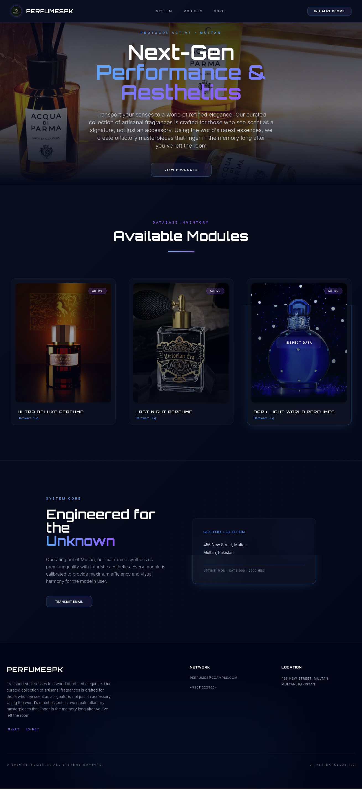 |
| **Forest** | 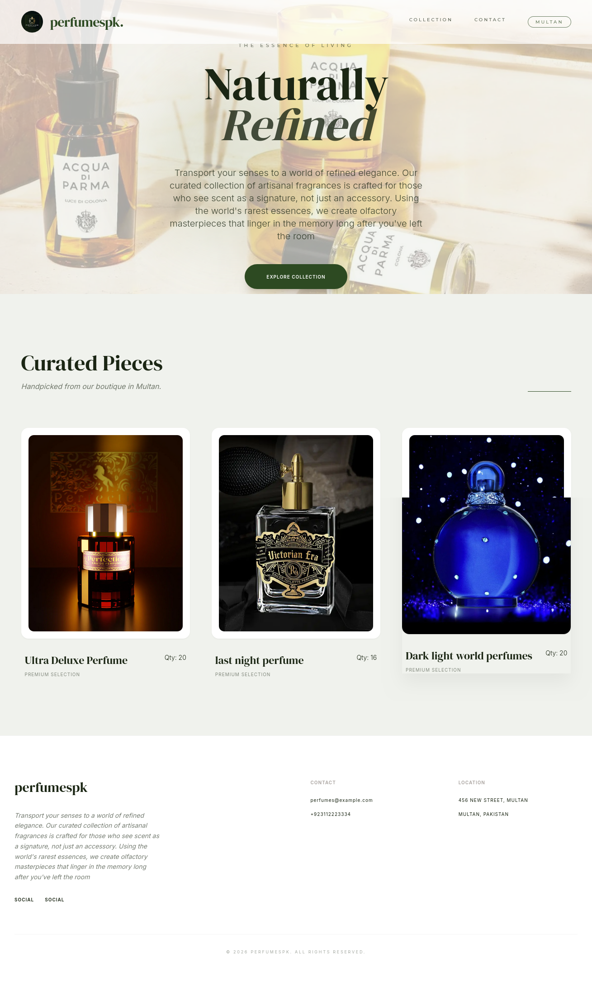 |
| **Gothic** |  |
| **Green Woods** | 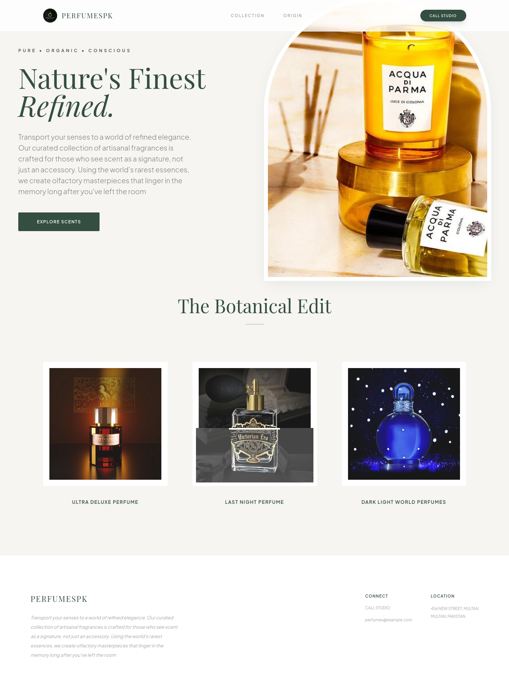 |
| **Neon Future** | 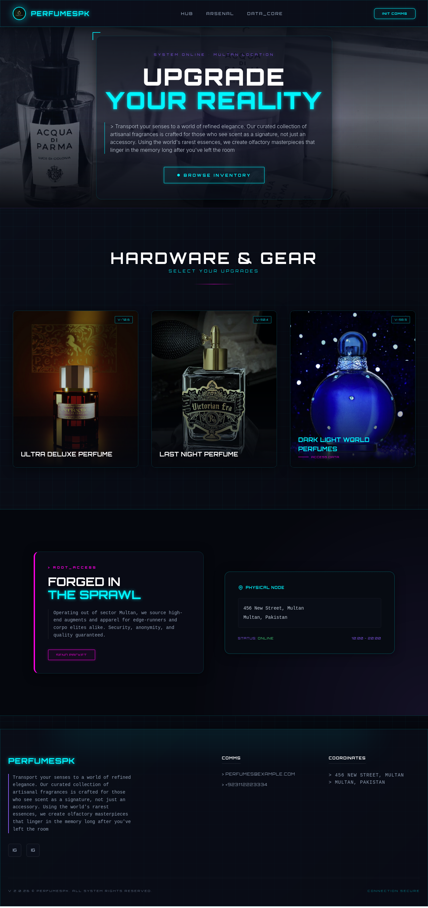 |
| **Soft Glass** | 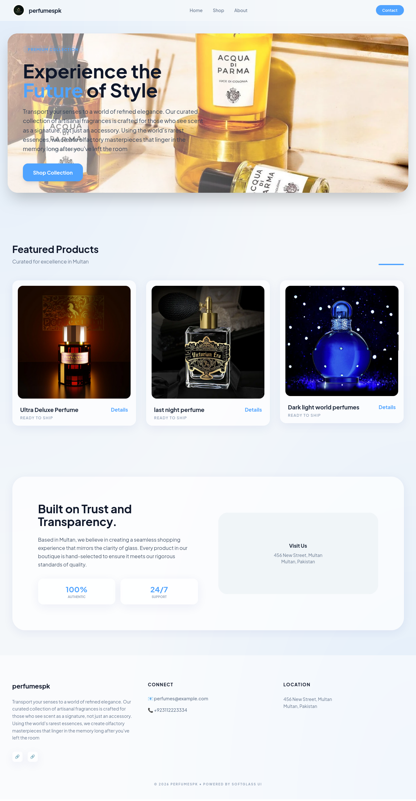 |

---

## 🔌 API Routes

### Auth
| Method | Endpoint | Description |
|--------|----------|-------------|
| `POST` | `/api/user/register` | Register a new user |
| `POST` | `/api/user/login` | Login & receive JWT cookie |
| `POST` | `/api/user/logout` | Logout & clear cookie |
| `PUT` | `/api/user/update-profile` | Update user profile |

### Website Builder
| Method | Endpoint | Description |
|--------|----------|-------------|
| `POST` | `/api/website/create` | Create a new website |
| `PUT` | `/api/website/update` | Update website settings |
| `GET` | `/api/website/preview` | Preview generated site |

### Dashboard
| Method | Endpoint | Description |
|--------|----------|-------------|
| `GET` | `/api/dashboard` | Fetch dashboard stats |
| `POST` | `/api/dashboard/product` | Add a product |

### Misc
| Method | Endpoint | Description |
|--------|----------|-------------|
| `POST` | `/api/email/send` | Send contact email |

---

## 📜 License

This project is licensed under the **ISC License**.

---

<div align="center">
sabih ur rehamn ---author
Made with  using React, Express & MongoDB

</div>

